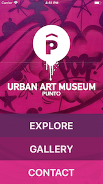
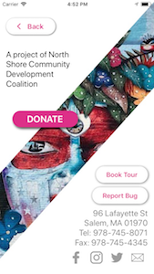

<br>

# Punto Urban Art Museum App
[](https://github.com/ellerbrock/open-source-badge/)


The Punto Urban Art Museum's vision is to create a world class urban arts district in Salem’s Point Neighborhood, one that embraces its rich immigrant and architectural history and presents a dynamic opportunity for the neighborhood’s future. The PUAM App allows the user to explore over 50 murals in this neighborhood, browse them using a map view or a gallery view, and read details about each mural.

<a href="https://itunes.apple.com/us/app/punto-urban-art-museum/id1320710363?ls=1&mt=8"></a>
<a href="https://itunes.apple.com/us/app/punto-urban-art-museum/id1320710363?ls=1&mt=8"></a>

This app is a project of the <a href="http://northshorecdc.org" alt="NSCDC">North Shore Community Development Coalition</a> and <a href="http://jumbocode.org" alt="JumboCode">JumboCode</a>.






## Test an *unreleased* version:
* Download the Expo App: <a href="https://play.google.com/store/apps/details?id=host.exp.exponent&hl=en">Android</a> / <a href="https://itunes.apple.com/us/app/expo-client/id982107779?mt=8">iOS</a>
* Scan this QR code using the Expo app:


## Test / Develop Locally
### Run the react-native App locally
* Create a file firebase.js in PUAMapp/ containing:

```
var config = {... firebase config info ...};
export default config;
```

* Install the dependencies and start the packager:

```
cd PUAMapp
npm install
npm start
```


### Run the Flask site locally
* Set the environment variables and start the server:

```
cd flask
export FIREBASE_PATH="<firebase path>"
export APP_KEY="<app key>"
export FLASK_APP=app.py
flask run
```


## Our Team
- Chris Anderson
- Barry Eom
- Benjamin Steephenson
- Brendan Fahey
- Emma Pannullo
- Ian Mao
- Isaiah Fischer-Brown
- Lillianna Levonick
- Suruchi Devanahalli
- Wayne Yirong Tang
- Zach Nassar
